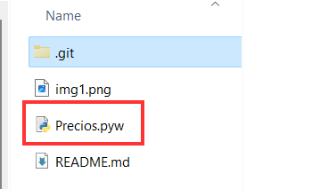
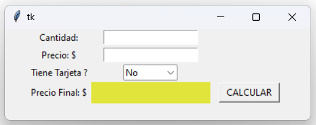
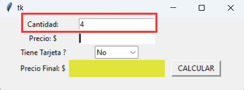
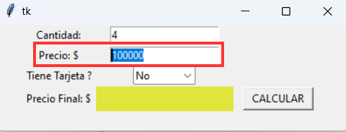
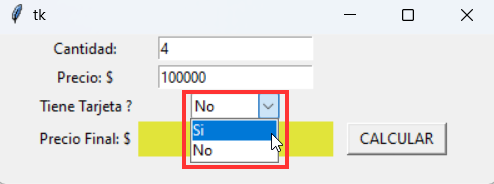
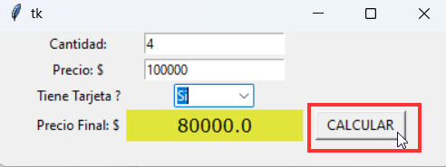

# 💲Calculadora de descuentos de precios 💲
##### Andres Mejia  

***
## Descripción
Esta aplicación permite recalcular el precio final que debe cobrarse a un cliente de acuerdo a la cantidad de productos que adquiere y si realiza su pago con tarjeta de credito, obteniendo descuentos de acuerdo a las siguientes condiciones:

* 3 o mas articulos y ***sin tarjeta*** --> **-10%**
* 3 o mas articulos y ***con tarjeta*** --> **-20%**
* 1 articulo y ***sin tarjeta*** --> **-15%**
* 1 articulo y ***con tarjeta*** --> **-5%**

> Para las demas opciones, no se aplicará descuento.

***
## Funcionamiento

### Ejecutar la app
Debe ubicarse la carpeta donde esté almacenada la app `Precios.pyw` y ejeutarla con doble clic:  


### Ventana Inicial
Se apreciará la siguiente ventana para ingresar la información:  


### Cantidad de articulos
Ingresar la cantidad de articulos teniendo en cuenta las [condiciones](#descripción) de descuento:  


### Precio sin descuento
Ingrese el precio sin aplicar ningun descuento, teniendo en cuenta las  [condiciones](#descripción):  


### Pago con tarjeta
Elija si el pago se realizará con tarjeta o no, teniendo en cuenta las  [condiciones](#descripción):  


### Precio con descuento
De clic en el boton ***CALCULAR*** para obtener el precio a pagar de acuerdo a las  [condiciones](#descripción):  


***
## Codigo

```Python
    
from tkinter import *  #Libreria de Interfaz Grafica
from tkinter import ttk


# Funcion que calcula el precio
def realizar_calculo():
	cant = int(cantidad.get())      #CANTIDAD --> Se toma el valor ingresado y se pasa a entero
	p_inicial = int(precio.get())   #PRECIO --> Se toma el valor ingresado y se pasa a entero
	tarj = menu.get()			    #TARJETA --> Se toma el dato de la tarjeta
	p_final = 0						# Se crea una variable para almacenar el precio final

	
	# Si son mas de 3 articulos:
	if cant >= 3: 
		if tarj == "No": # NO tiene tarjeta
			p_final = p_inicial - (p_inicial*0.1) # 10%
		else: # SI tiene tarjeta
			p_final = p_inicial - (p_inicial*0.2) # 20%

	
	# Solo compra 1 articulo:
	elif cant == 1: 
		if tarj == "Si": # SI tiene tarjeta
			p_final = p_inicial - (p_inicial*0.15) # 15%
		else: # NO tiene tarjeta
			p_final = p_inicial - (p_inicial*0.05) # 5%


	# Por defecto:
	else:
		p_final = p_inicial


	precio_final.config(text=p_final) # Se muestra el precio FINAL en el campo correspondiente


#---------------- Interfaz Grafica --------------------------------
ventana_principal = Tk()


miFrame = Frame(ventana_principal)
miFrame.pack()

lblCant = Label(miFrame,text="Cantidad:")
lblCant.grid(row=2,column=2,padx=1,pady=1)

cantidad=Entry(miFrame)
cantidad.grid(row=2,column=3,padx=1,pady=1)

lblPrecio = Label(miFrame,text="Precio: $")
lblPrecio.grid(row=3,column=2,padx=1,pady=1)

precio=Entry(miFrame)
precio.grid(row=3,column=3,padx=1,pady=1)

lblTarjeta = Label(miFrame,text="Tiene Tarjeta ?")
lblTarjeta.grid(row=4,column=2,padx=1,pady=1)

menu = ttk.Combobox(miFrame,  textvariable = "No", width=8, values = ["Si","No"])
menu.grid(row=4,column=3,padx=1,pady=1)
menu.set("No")

lblPrecioF = Label(miFrame,text="Precio Final: $")
lblPrecioF.grid(row=5,column=2,padx=1,pady=1)

precio_final=Label(miFrame)
precio_final.grid(row=5,column=3,padx=1,pady=1)
precio_final.config(background="white", fg="black", width=15)

botonCalcular = Button(miFrame,text="CALCULAR",width=10,command=realizar_calculo)
botonCalcular.grid(row=5,column=4,padx=10,pady=1)


ventana_principal.mainloop()
```

***